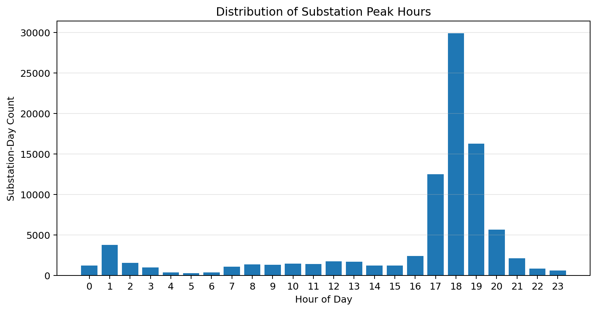
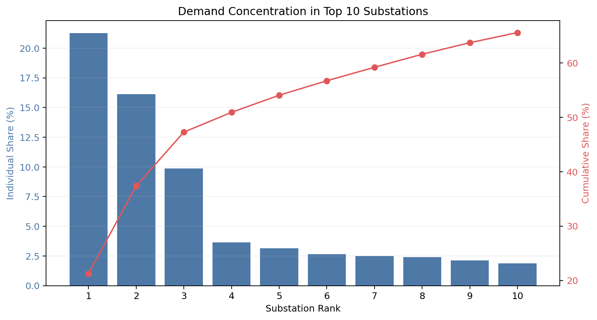

<!-- Summary: AWS-native UK smart meter pipeline with external Bronze, Glue transforms, Athena querying, and Terraform-managed infrastructure. -->
# Energy Smart Meter Pipeline

AWS data engineering project for UK smart meter half-hourly consumption data.

The pipeline reads an external Bronze dataset, transforms it with AWS Glue (PySpark), writes Silver/Gold parquet to S3, exposes tables through Glue Catalog + Athena, and runs SQL QA checks.

## Insight Snapshots

### Peak Hour Distribution



This chart shows when substations most frequently hit their daily peak. In this dataset, peak events are concentrated in a narrow evening window rather than being evenly spread across the day.

### Top 10 Demand Concentration



This chart shows how much of total demand is carried by the highest-demand substations. The cumulative line highlights concentration risk by showing how quickly demand share accumulates across the top ranks.

## Architecture

`External S3 Bronze (read-only) -> Glue PySpark transform -> S3 Silver/Gold -> Glue Catalog -> Athena`

Components:

- `S3` for Silver, Gold, and run-log parquet data
- `AWS Glue Job` for PySpark transformations
- `AWS Glue Data Catalog` for table metadata
- `Athena` for querying and QA SQL checks
- `EventBridge Scheduler` to trigger Glue jobs
- `Lake Formation` for data permissions
- `Terraform` for infra-as-code

## Key design choices

- Bronze is external and read-only (`s3://weave.energy/smart-meter.parquet` by default).
- No copied internal Bronze layer.
- Glue job is kept defined, but daily schedule can be disabled to reduce cost.
- Partition projection is enabled on Silver/Gold/Run Log tables to avoid manual partition repair.
- Data bucket can be preserved during teardown (`preserve_data = true`).

## Repo Layout

```text
uk-smart-meter-data/
├── README.md
├── pyproject.toml
├── docs/
├── eda/
├── src/
├── sql/
├── tests/
└── terraform/
```

## Source dataset

Source dataset (Bronze, read-only):

- Provider: Weave
- S3 location: `s3://weave.energy/smart-meter.parquet`

Expected source columns:

| Column | Description |
| --- | --- |
| `dataset_id` | Source record identifier for the dataset slice/batch. |
| `dno_alias` | Distribution Network Operator alias (for example, regional operator label). |
| `aggregated_device_count_active` | Number of active devices/meters aggregated into the half-hour reading. |
| `total_consumption_active_import` | Total active-import energy consumption for the record interval. |
| `data_collection_log_timestamp` | Timestamp of the half-hour measurement in the source feed. |
| `geometry` | Spatial point geometry for the feeder/substation context (stored as struct in parquet). |
| `secondary_substation_unique_id` | Unique identifier for the secondary substation. |
| `lv_feeder_unique_id` | Unique identifier for the low-voltage feeder. |
| `bbox` | Bounding-box geometry metadata for spatial coverage (stored as struct in parquet). |

## Outputs

Silver table:

- `silver_smart_meter_half_hourly_clean`
- partition key: `collection_date`

Gold tables:

- `gold_peak_demand_substation_day`
- `gold_avg_load_profile_day`
- partition key: `consumption_date`

`gold_peak_demand_substation_day` columns:

| Column | Description |
| --- | --- |
| `consumption_date` | Date of consumption aggregated to day level (partition key). |
| `dno_alias` | DNO alias for the substation group. |
| `secondary_substation_unique_id` | Unique identifier of the secondary substation. |
| `peak_consumption` | Maximum half-hourly consumption value observed for that substation/day. |
| `peak_timestamp` | Timestamp at which `peak_consumption` occurred. |
| `daily_total_consumption` | Sum of half-hourly consumption across the full day for that substation. |
| `avg_half_hour_consumption` | Average half-hourly consumption across the day for that substation. |
| `avg_active_devices` | Average active device count across the day for that substation. |
| `feeder_count` | Distinct number of feeders observed for that substation/day. |
| `reading_count` | Total number of half-hourly rows aggregated for that substation/day. |

`gold_avg_load_profile_day` columns:

| Column | Description |
| --- | --- |
| `consumption_date` | Date of consumption aggregated by half-hour slot (partition key). |
| `hour_of_day` | Hour component (0-23) of the slot. |
| `minute_of_hour` | Minute component of the slot (typically 0 or 30). |
| `half_hour_slot` | Zero-based slot index for the day (0-47). |
| `avg_consumption` | Average consumption across all contributing rows for that day/slot. |
| `total_consumption` | Total consumption summed across all contributing rows for that day/slot. |
| `reading_count` | Number of rows contributing to that day/slot aggregate. |
| `substation_count` | Distinct number of substations contributing to that day/slot aggregate. |
| `feeder_count` | Distinct number of feeders contributing to that day/slot aggregate. |
| `avg_consumption_per_active_device` | Mean of per-row consumption-per-active-device for that day/slot. |

Run log table:

- `pipeline_run_log`
- partition key: `run_date`

## Prerequisites

- Python `3.11`
- Terraform `>= 1.5`
- AWS CLI configured (`default` profile or your chosen profile)
- Permissions for S3, Glue, Athena, EventBridge, IAM, and Lake Formation

## Local Python setup

From `uk-smart-meter-data/`:

```bash
python3.11 -m venv smart-meter-venv
source smart-meter-venv/bin/activate
pip install -e .
```

## Terraform configuration

Edit `terraform/terraform.tfvars`.

Important fields:

- `data_bucket_name`
- `athena_results_bucket_name`
- `external_source_s3_uri`
- `preserve_data`
- `enable_daily_schedule`
- `tags`

Example tags for cost attribution:

```hcl
tags = {
  Workload  = "uk-smart-meter"
  CostScope = "portfolio"
  CostOwner = "will"
}
```

Enable those tag keys in AWS Billing as cost allocation tags so they appear in Cost Explorer.

## Deploy

From `terraform/`:

```bash
terraform init
terraform plan
terraform apply
```

## Run pipeline manually

Start one Glue run for a specific date:

```bash
aws glue start-job-run \
  --job-name energy-smart-meter-pipeline-dev-transform-daily \
  --arguments '{"--run-date":"2024-02-02"}'
```

Backfill a date range sequentially (waits for each run to finish):

```bash
python src/backfill_glue_range.py \
  --job-name energy-smart-meter-pipeline-dev-transform-daily \
  --start-date 2024-02-01 \
  --end-date 2024-02-29
```

## Query with Athena

Example:

```sql
SELECT collection_date, COUNT(*) AS row_count
FROM energy_smart_meter.silver_smart_meter_half_hourly_clean
WHERE collection_date = DATE '2024-02-02'
GROUP BY 1;
```

Notes:

- Partition projection is enabled, so you should not need `MSCK REPAIR TABLE` for projected tables.
- If queries fail on column access, check Lake Formation table and column permissions.

## Mini Athena CLI

Run any SQL file or inline query via Athena:

```bash
python src/athena_cli.py \
  --sql-file sql/insights/01_date_coverage.sql \
  --database energy_smart_meter \
  --workgroup energy-smart-meter-pipeline-dev-athena \
  --output-s3-uri s3://smart-meter-athena-results/athena-results/ \
  --aws-region eu-west-2
```

Inline query example:

```bash
python src/athena_cli.py \
  --query "SELECT COUNT(*) AS c FROM energy_smart_meter.gold_peak_demand_substation_day" \
  --database energy_smart_meter \
  --workgroup energy-smart-meter-pipeline-dev-athena \
  --output-s3-uri s3://smart-meter-athena-results/athena-results/ \
  --aws-region eu-west-2
```

Optional:

- `--max-rows 200` to control terminal output size
- `--save-json out.json` to export query results

## Gold Table Insights Runner

Run curated portfolio insight queries from `sql/insights/` and print synthesized findings:

```bash
python src/gold_insights.py \
  --database energy_smart_meter \
  --workgroup energy-smart-meter-pipeline-dev-athena \
  --output-s3-uri s3://smart-meter-athena-results/athena-results/ \
  --aws-region eu-west-2
```

## QA checks

SQL checks are in `sql/qa_*.sql` and include:

- Freshness
- Completeness
- Uniqueness
- Null checks
- Business rules and drift checks

Run QA script:

```bash
python src/run_qa_checks.py --run-date 2024-02-02
```

## Troubleshooting

`EntityNotFoundException` on `start-job-run`:

- Verify Glue job name from Terraform outputs.

`ConcurrentRunsExceededException`:

- Wait for prior job completion or use `backfill_glue_range.py` sequential mode.

Athena returns zero rows but files exist:

- Verify table `LOCATION` and partition path template.
- Verify date filter matches partition key and format.

`COLUMN_NOT_FOUND ... cannot be resolved or requester is not authorized`:

- This is usually Lake Formation permissions, not missing columns in file schema.
- Check table `SELECT`, `DESCRIBE`, and column wildcard grants for the querying principal.

`AccessDeniedException Required Alter/Drop` during Terraform apply/destroy:

- Grant required Lake Formation table permissions (`ALTER`, `DROP`) for the Terraform principal.
